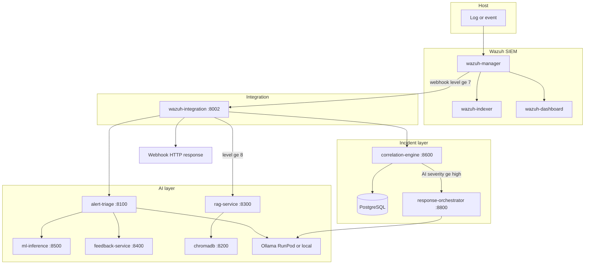

# AI-SOC End-to-End Pipeline Flow

A reader-friendly guide to how alerts move through AI-SOC: from a host event to LLM analysis, knowledge enrichment, incident grouping, and optional automated defense.

**Related documentation:**

- [docs/deployment/runpod-ollama.md](docs/deployment/runpod-ollama.md) — GPU Ollama on RunPod
- [docs/WAZUH_INTEGRATION_GUIDE.md](docs/WAZUH_INTEGRATION_GUIDE.md) — Wazuh webhook setup
- [docs/architecture/dataflow.md](docs/architecture/dataflow.md) — broader data-flow patterns
- [sample_inputs/](sample_inputs/) — JSON bodies for manual API testing

---

## Table of contents

1. [Purpose and paths](#purpose-and-paths)
2. [Prerequisites](#prerequisites)
3. [High-level diagram](#high-level-diagram)
4. [Severity gates](#severity-gates)
5. [Services and ports](#services-and-ports)
6. [Step 1 — Event on host](#step-1--event-on-host)
7. [Step 2 — Wazuh detection](#step-2--wazuh-detection)
8. [Step 3 — Webhook to integration](#step-3--webhook-to-integration)
9. [Step 4 — Alert triage (LLM)](#step-4--alert-triage-llm)
10. [Step 5 — RAG enrichment](#step-5--rag-enrichment)
11. [Step 6 — Correlation (incidents)](#step-6--correlation-incidents)
12. [Step 7 — Response orchestrator](#step-7--response-orchestrator)
13. [Step 8 — Webhook response](#step-8--webhook-response)
14. [Alternate paths](#alternate-paths)
15. [Startup and shutdown](#startup-and-shutdown)

---

## Purpose and paths

AI-SOC answers: **given a security alert, what does it mean, is it related to other alerts, and what should we do?**

There are two main ways alerts enter the AI layer:

| Path | How it starts | Steps that run |
|------|----------------|----------------|
| **Automatic (natural)** | Wazuh rule fires → webhook → `wazuh-integration` | 3 → 4 → 5 (if hot) → 6 → 7 (if severe) → 8 |
| **Manual (lab)** | You `POST` JSON to `alert-triage` | 4 only (+ feedback save) |

Steps 1–2 are always Wazuh/SIEM. Steps 3–8 require the integration webhook and running stack (except manual triage).

---

## Prerequisites

Before the full automatic pipeline works:

| Requirement | What it enables |
|-------------|-----------------|
| `.\deploy-ai-soc.ps1 -OllamaRemote` (or local Ollama) | AI services + Wazuh + monitoring |
| `OLLAMA_BASE_URL` in `.env` | LLM calls from triage, orchestrator, rule-generator |
| RunPod: `ollama serve` on pod | Remote inference |
| RAG ingest on deploy (`/ingest/mitre`, `/ingest/runbooks`) | ChromaDB knowledge for step 5 |
| Wazuh `<integration>` webhook in `ossec.conf` | Step 3 ([config/wazuh-manager/ossec.conf](config/wazuh-manager/ossec.conf)) |
| Logs reaching Wazuh | Step 2 (agent, syslog, or `localfile`) |

On **Windows**, the SIEM compose file excludes Suricata/Zeek (`phase1-siem-core-windows.yml`). Network IDS alerts are not part of the default Windows lab unless you add sources manually.

---

## High-level diagram

Automatic path (webhook configured):



---

## Severity gates

Two different severity concepts are used:

| Name | Who sets it | Range / values | Used for |
|------|-------------|----------------|----------|
| **Wazuh `rule.level`** | Wazuh rule engine | 0–15 | Webhook accept (≥7), RAG (≥8), logging |
| **AI `severity`** | LLM in alert-triage | critical, high, medium, low, informational | Incident record, auto-defense (≥ high) |

| Gate | Default threshold | Service / env |
|------|-------------------|---------------|
| Webhook processing | `rule.level ≥ 7` | `MIN_SEVERITY` on wazuh-integration |
| RAG enrichment | `rule.level ≥ 8` | `RAG_SEVERITY_THRESHOLD` |
| Auto-defense | AI `severity ≥ high` | `AUTO_DEFEND_MIN_SEVERITY` on correlation-engine |

---

## Services and ports

| Service | Host port | Role in pipeline |
|---------|-----------|------------------|
| wazuh-dashboard | 443 | View raw Wazuh alerts |
| wazuh-integration | 8002 | Webhook bridge (steps 3–8) |
| alert-triage | 8100 | LLM analysis (step 4) |
| rag-service | 8300 | MITRE/runbook retrieval (step 5) |
| chromadb | 8200 | Vector store for RAG |
| feedback-service | 8400 | Alert history / analyst feedback |
| ml-inference | 8500 | ML score for triage prompt |
| correlation-engine | 8600 | Incident grouping (step 6) |
| rule-generator | 8700 | Sigma drafts (optional, not per-alert) |
| response-orchestrator | 8800 | Defense plans (step 7) |
| postgres | 5435 | Incidents, feedback, orchestrator state |
| grafana | 3000 | Metrics dashboards |

Internal Docker hostnames (e.g. `http://alert-triage:8000`) differ from host ports above.

---

## Step 1 — Event on host

**What it entails:** Something observable happens on a system or network and is recorded as a log line or telemetry event.

### 1a — Event sources

| Source | How it reaches Wazuh | Default Windows lab |
|--------|----------------------|---------------------|
| Wazuh agent | TCP 1514 | If agents installed |
| Syslog | UDP 514 | Manager listens |
| `localfile` | Tail a file path in `ossec.conf` | Built-in commands only (`df`, `netstat`, `last`) unless you add paths |
| Injected test log | Demo script appends to `/var/log/injection-test.log` | Only when running `scripts/wazuh-injection-demo.sh` |

### 1b — What the event contains (example)

SSH brute-force attempt (single line):

```text
Failed password for invalid user root from 203.0.113.42 port 22 ssh2
```

### 1c — Output of this step

- A **raw log line** on the host or forwarded to the manager.
- **Not an alert yet** — no rule has fired.

---

## Step 2 — Wazuh detection

**Service:** `wazuh-manager`, `wazuh-indexer`, `wazuh-dashboard`  
**What it entails:** Wazuh ingests the log, parses it, matches detection rules, and may create an alert.

### 2a — Ingest

- Manager receives the event (agent, syslog, or `localfile`).
- Event is buffered and passed to the analysis daemon (`wazuh-analysisd`).

### 2b — Decode

- **Decoder** identifies log format (program name, e.g. `sshd`).
- **Extracted fields** populate `data` in the alert: `srcip`, `dstip`, `srcuser`, ports, etc.

### 2c — Rule match

- **Rule engine** evaluates thousands of built-in rules from the Wazuh image (`ruleset/rules`).
- This repo mounts [config/wazuh-manager/ossec.conf](config/wazuh-manager/ossec.conf) but does **not** ship custom rule XML files.
- Rules can chain: e.g. single SSH failure (lower level) → multiple failures trigger a higher rule.

**SSH brute-force example (common in this project):**

| Rule ID | Typical level | Meaning |
|---------|---------------|---------|
| 5716 | ~5 | Single SSH authentication failure |
| 5712 | 10 | Login attempt with non-existent user |
| **5710** | **10** | Multiple failed logins (correlation) |

### 2d — Alert creation

- If matched rule level ≥ `log_alert_level` (3 in `ossec.conf`), Wazuh emits **alert JSON**.
- Alert includes MITRE mapping when the rule defines it (e.g. T1110.001 Brute Force).

### 2e — Storage and visibility

| Destination | Contains |
|-------------|----------|
| `/var/ossec/logs/alerts/alerts.json` | Full alert JSON on manager |
| wazuh-indexer | Searchable indexed copy |
| Wazuh Dashboard | Analyst UI |

### 2f — Example Wazuh alert shape

Key fields (see `services/wazuh-integration/models.py`):

```json
{
  "id": "1705155045.123456",
  "timestamp": "2025-01-13T14:30:45.123+0000",
  "rule": {
    "id": "5710",
    "level": 10,
    "description": "Multiple failed login attempts",
    "mitre": {
      "id": ["T1110"],
      "tactic": ["Credential Access"],
      "technique": ["Brute Force"]
    }
  },
  "agent": { "id": "001", "name": "web-server-01", "ip": "10.0.1.50" },
  "data": { "srcip": "203.0.113.42", "srcuser": "admin" },
  "full_log": "Jan 13 14:30:45 ... Failed password for admin from 203.0.113.42 ..."
}
```

### 2g — Failure / stop conditions

- No rule match → event discarded or logged only → **pipeline stops** (no AI).
- Rule level below webhook threshold → alert may exist in Wazuh but integration rejects it in step 3.

---

## Step 3 — Webhook to integration

**Service:** `wazuh-integration` (`POST /webhook`, host port **8002**)  
**Gate:** Wazuh `rule.level ≥ 7` (`MIN_SEVERITY`)

### 3a — Wazuh integrator sends alert

Wazuh must have an `<integration>` block (included in [config/wazuh-manager/ossec.conf](config/wazuh-manager/ossec.conf); restart manager after changes):

```xml
<integration>
  <name>custom-webhook</name>
  <hook_url>http://wazuh-integration:8002/webhook</hook_url>
  <level>7</level>
  <alert_format>json</alert_format>
</integration>
```

### 3b — Parse and filter

- Body parsed into `WazuhAlert` model.
- If `rule.level < 7` → HTTP 400, alert not processed by AI.

### 3c — Transform for triage

`AIClient.transform_wazuh_to_triage_format()` maps to `SecurityAlert` fields:

| Wazuh field | Triage field |
|-------------|--------------|
| `id` | `alert_id` |
| `rule.id` | `rule_id` |
| `rule.description` | `rule_description` |
| `rule.level` | `rule_level` |
| `full_log` | `raw_log` |
| entire alert | `full_log` (dict) |
| `rule.mitre.id` | `mitre_technique` |
| `agent.name` / `data.srcip` | `source_hostname` / `source_ip` |
| `data.dstip`, ports, users | `dest_ip`, `dest_port`, `user`, etc. |

### 3d — Output of this step

- Validated in-memory request ready for step 4.
- No persistent storage at integration until triage completes.

---

## Step 4 — Alert triage (LLM)

**Service:** `alert-triage` (`POST /analyze`, host port **8100**)  
**Also uses:** `ml-inference` (:8500), `feedback-service` (:8400), **Ollama** (`OLLAMA_BASE_URL`)

RAG is **not** called inside triage (`TRIAGE_RAG_ENABLED` defaults to false). Step 5 handles RAG separately.

### 4a — Input: `SecurityAlert`

**Required fields:**

| Field | Type | Description |
|-------|------|-------------|
| `alert_id` | string | Unique ID |
| `rule_description` | string | Human-readable alert text |
| `rule_level` | int 0–15 | Wazuh severity |

**Optional but valuable:**

| Field | Description |
|-------|-------------|
| `rule_id` | Wazuh rule ID (e.g. `5710`) |
| `timestamp` | ISO datetime |
| `source_ip`, `dest_ip`, ports | Network context |
| `user`, `process`, `command` | Identity / process context |
| `raw_log` | Original log line |
| `full_log` | Full Wazuh JSON as dict |
| `mitre_technique` | List of technique IDs |

Example payloads: [sample_inputs/alert-triage-analyze-ssh-bruteforce.json](sample_inputs/alert-triage-analyze-ssh-bruteforce.json)

### 4b — Context from feedback-service

`ContextManager.build_context()` (`services/alert-triage/context_manager.py`):

| Layer | What it fetches | What it contains |
|-------|-----------------|------------------|
| Environment | `/contexts` or env default | Static org notes (allowed scanners, critical assets) |
| Alert history | `/alerts?source_ip=...` | Recent alerts from same IP |
| Analyst feedback | `/alerts` with feedback flags | Past true/false positive labels for that IP |

- Timeout ~5 seconds per call; failures return empty string (triage never blocked).
- Injected into the LLM prompt as supplementary text.

### 4c — ML inference (optional)

If `TRIAGE_ML_ENABLED`:

- `POST ml-inference` with flow-like features derived from alert.
- Returns `prediction` + `confidence` (e.g. benign vs attack class).
- Appended to prompt via `enrich_llm_prompt_with_ml()` — **hint only**, not the final verdict.

### 4d — LLM analysis (core)

1. Build security-focused prompt (alert fields + context + ML hint).
2. `POST {OLLAMA_BASE_URL}/api/generate` with `format: json`, `stream: false`.
3. Primary model: `OLLAMA_MODEL` (default `llama3.2:3b`).
4. Parse response into `TriageResponse`.
5. On primary failure, try fallback model; if both fail → HTTP **503** (pipeline stops).

### 4e — Output: `TriageResponse`

| Field | Description |
|-------|-------------|
| `severity` | AI assessment: critical / high / medium / low / informational |
| `category` | malware, intrusion_attempt, data_exfiltration, … |
| `confidence` | 0.0–1.0 model confidence |
| `summary` | Short analyst-facing summary |
| `detailed_analysis` | Technical narrative |
| `potential_impact` | Business/security impact |
| `is_true_positive` | Real threat vs noise |
| `false_positive_reason` | Set when classified as FP |
| `iocs` | List of `{ioc_type, value, confidence}` |
| `mitre_techniques`, `mitre_tactics` | AI’s MITRE mapping (may differ from Wazuh) |
| `recommendations` | `{action, priority, rationale}` list |
| `investigation_priority` | 1–5 urgency |
| `estimated_analyst_time` | Minutes (optional) |
| `model_used` | Model identifier |
| `processing_time_ms` | Latency |
| `ml_prediction`, `ml_confidence` | If ML ran |

### 4f — Persist to feedback-service (background)

Fire-and-forget `POST feedback-service/alerts` with:

- Raw alert fields, full `triage_result` JSON, `ai_severity`, `ai_category`, `ai_confidence`, `ai_is_true_positive`, ML metadata.

Stored in **PostgreSQL** for history, context on future alerts, and retraining workflows.

### 4g — Failure behavior

| Condition | Result |
|-----------|--------|
| Ollama unreachable | 503, steps 5–8 do not run on webhook path |
| Feedback save fails | Warning logged; triage response still returned |

---

## Step 5 — RAG enrichment

**Service:** `rag-service` (`POST /retrieve`, host port **8300**)  
**Storage:** `chromadb` (:8200)  
**Gate:** Wazuh **`rule.level ≥ 8`** (`RAG_SEVERITY_THRESHOLD`) — not AI severity.

Called by **wazuh-integration** after step 4, not by alert-triage.

### 5a — Query construction

Integration builds a text query from:

- Wazuh `rule.description`
- MITRE IDs from `alert.rule.mitre.id` (e.g. `"MITRE T1110"`)

### 5b — Retrieval request

```json
{
  "query": "Multiple failed login attempts MITRE T1110",
  "collection": "mitre_attack",
  "top_k": 3,
  "min_similarity": 0.5
}
```

### 5c — Inside RAG

1. Embed query (sentence-transformers).
2. Vector search in ChromaDB collection.
3. Filter by similarity ≥ 0.5.
4. Return top 3 document chunks with scores and metadata.

**Collections** (populated at deploy via `Invoke-KBIngestion`):

| Collection | Content |
|------------|---------|
| `mitre_attack` | MITRE ATT&CK techniques/tactics |
| `cve_database` | CVE entries (ingest optional) |
| `security_runbooks` | Response playbooks (e.g. SSH brute force) |

### 5d — Merge into enriched response

| Field | Content |
|-------|---------|
| `mitre_context` | Concatenated text snippets from top hits (truncated ~500 chars each) |
| `kb_references` | Technique IDs from result metadata |
| `rag_enrichment_applied` | `true` |

### 5e — What RAG does not do

- Does not call the LLM again.
- Does not modify `TriageResponse` fields.
- Does not write to Postgres by itself.

### 5f — Failure behavior

- HTTP error or timeout → `rag_result = None`, warning logged.
- Triage + correlation still proceed.

---

## Step 6 — Correlation (incidents)

**Service:** `correlation-engine` (`POST /correlate`, host port **8600**)  
**Storage:** PostgreSQL (`incidents`, `incident_alerts`)  
**Trigger:** Always on webhook path after steps 4–5.

### 6a — Correlation request

Integration sends (`services/wazuh-integration/ai_client.py`):

```json
{
  "alert_id": "<wazuh_alert_id>",
  "timestamp": "<processing_timestamp ISO>",
  "severity": "<ai_severity>",
  "category": "<ai_category>",
  "mitre_techniques": ["T1110", ...],
  "mitre_tactics": [],
  "rule_description": "<wazuh_rule_description>"
}
```

**Implementation note:** The webhook path currently does **not** pass `source_ip` or `dest_ip` in this payload, so IP-overlap scoring (40% weight) may not apply until those fields are added. Temporal and kill-chain components still apply.

Full model: `CorrelationRequest` in `services/correlation-engine/models.py`.

### 6b — Scoring against open incidents

For each **active** incident, compute score ∈ [0, 1]:

| Component | Weight | What it measures |
|-----------|--------|------------------|
| Temporal proximity | 40% | Alert time vs incident `last_seen` (default 15 min window, exponential decay) |
| IP overlap | 40% | `source_ip` / `dest_ip` match incident IP lists |
| Kill chain progression | 20% | MITRE tactics advance incident stage |

**Defaults** (`services/correlation-engine/config.py`):

- `correlation_threshold`: **0.6**
- `temporal_window_minutes`: **15**

### 6c — Decision

| Outcome | Condition | Action |
|---------|-----------|--------|
| Attach | Best score ≥ 0.6 | Link alert to incident; increment `alert_count`; update severity/stage if worse |
| New incident | No match above threshold | Create `INC-YYYYMMDDHHmmss-xxxx` |

### 6d — Kill chain stages

Stages (ordered): reconnaissance → initial_access → execution → persistence → privilege_escalation → lateral_movement → collection → command_and_control → exfiltration → impact.

MITRE tactic names map to stages via `TACTIC_TO_STAGE` in `services/correlation-engine/models.py`.

### 6e — Database records

| Table | Contains |
|-------|----------|
| `incidents` | incident_id, severity, status, source_ips, dest_ips, kill_chain_stage, alert_count, summary, timestamps |
| `incident_alerts` | Links alert_id to incident_id |

### 6f — Output on `EnrichedAlert`

| Field | Meaning |
|-------|---------|
| `incident_id` | e.g. `INC-20250604120000-a1b2` |
| `incident_is_new` | `true` if created this request |
| `incident_alert_count` | Total alerts in incident |
| `kill_chain_stage` | Current stage string |

### 6g — Side effect: trigger step 7

After correlate returns, correlation-engine may asynchronously call response-orchestrator (see step 7).

### 6h — Failure behavior

- Correlation error → logged; webhook still returns triage + RAG fields without incident fields.

---

## Step 7 — Response orchestrator

**Service:** `response-orchestrator` (`POST /defend`, host port **8800**)  
**Triggered by:** `correlation-engine` (`_trigger_defense`), **not** wazuh-integration.

### 7a — Gates

| Setting | Default | Effect |
|---------|---------|--------|
| `AUTO_DEFEND_ENABLED` | `true` | Master switch |
| `AUTO_DEFEND_MIN_SEVERITY` | `high` | AI severity must be high or critical |

Uses **AI severity** from step 4, not Wazuh level 8.

### 7b — Trigger request

```json
{
  "incident_id": "INC-...",
  "auto_execute": true,
  "dry_run": false,
  "skip_simulation": false
}
```

### 7c — Fetch incident

`GET correlation-engine/incidents/{incident_id}` — alerts, IPs, MITRE, kill chain, summary.

### 7d — Simulation (optional)

Unless `skip_simulation`:

- Calls correlation-engine simulation APIs.
- Models attacker movement on environment graph (`config/simulation/default-environment.json`).
- Produces predicted next techniques/targets for planning.

### 7e — Defense plan generation

`ResponseOrchestrator.trigger_defense()`:

1. Planner ranks countermeasures (D3FEND-oriented).
2. May call **Ollama** (`ORCHESTRATOR_OLLAMA_HOST`) for action rationale.
3. Builds `DefensePlan`: list of actions with approval tiers.

### 7f — Execution

| Tier | Behavior |
|------|----------|
| Auto-safe | Executed immediately if `auto_execute` and not `dry_run` |
| Requires approval | Status `AWAITING_APPROVAL` |

Adapters (firewall, Wazuh active response, identity, rule-generator) exist but many are **stubs** in this research repo — plans are real; external effect may be simulated only.

### 7g — Verification (background)

- Re-simulation or monitoring checks.
- Outcome logged to feedback-service / orchestrator tables.

### 7h — Output

- Defense plan in orchestrator DB (`plan_id`, actions, statuses).
- **Not** included in the Wazuh webhook JSON from step 8.
- Query via `GET http://localhost:8800/plans` or service logs.

### 7i — Failure behavior

- Orchestrator failure does not fail webhook; correlation already completed.

---

## Step 8 — Webhook response

**What it entails:** Integration returns HTTP 200 with `EnrichedAlert` JSON to the Wazuh integrator.

### 8a — Response fields (`EnrichedAlert`)

| Group | Fields |
|-------|--------|
| Wazuh | `wazuh_alert_id`, `wazuh_rule_level`, `wazuh_rule_description` |
| AI triage | `ai_severity`, `ai_category`, `ai_confidence`, `ai_summary`, `ai_is_true_positive`, `ai_recommendations`, `investigation_priority` |
| RAG | `mitre_context`, `kb_references`, `rag_enrichment_applied` |
| Incident | `incident_id`, `incident_is_new`, `incident_alert_count`, `kill_chain_stage` |
| Meta | `processing_timestamp` |

### 8b — What does not happen automatically

- AI fields are **not** written back into Wazuh Dashboard.
- Defense plan is **not** in this JSON (see step 7).
- No email/Slack unless you add external integrations.

### 8c — Where analysts work

| Need | Where |
|------|-------|
| Raw SIEM alert | Wazuh Dashboard :443 |
| AI verdict | Webhook logs, `GET /8002/alerts`, or direct `POST /8100/analyze` |
| Incident | `GET http://localhost:8600/incidents` |
| Defense plan | `GET http://localhost:8800/plans` |
| Metrics | Grafana :3000 |

---

## Alternate paths

### Manual triage (lab)

```text
POST http://localhost:8100/analyze
Body: sample_inputs/*.json
```

| Step | Runs? |
|------|-------|
| 1–3 Wazuh / webhook | No |
| 4 Triage + feedback | Yes |
| 5 RAG | No |
| 6 Correlation | No |
| 7 Orchestrator | No |

### Pull alerts from Wazuh API

`GET http://localhost:8002/alerts?limit=10&time_range=1h`

- Fetches alerts from Wazuh Manager API.
- Runs triage + RAG (if level ≥ 8) per alert.
- **Does not** call correlation-engine (no incident grouping in this path).

### Batch triage

`POST http://localhost:8100/batch` with JSON array — multiple step-4 analyses in parallel; no steps 5–7 unless separately invoked.

---

## Startup and shutdown

**Start (remote Ollama):**

```powershell
cd AI_SOC
.\deploy-ai-soc.ps1 -OllamaRemote
```

**Stop:**

```powershell
.\deploy-ai-soc.ps1 -Stop
```

Does not stop RunPod Ollama — stop `ollama serve` or the pod separately.

**End-to-end demo (Wazuh → AI):**

```bash
./scripts/wazuh-injection-demo.sh
```

Injects SSH failure lines, triggers rule 5710, exercises webhook → triage → integration logs.

---

## Quick reference: one alert through the stack

```text
1. sshd: Failed password ...        (host log)
2. Wazuh rule 5710, level 10       (SIEM alert)
3. POST /webhook                     (integration, level ≥ 7)
4. POST /analyze → Ollama            (AI verdict + Postgres history)
5. POST /retrieve → ChromaDB         (if level ≥ 8)
6. POST /correlate → Postgres        (incident INC-...)
7. POST /defend                      (if AI severity ≥ high)
8. EnrichedAlert JSON response       (to integrator)
```

---

*Generated for the AI-SOC research stack. For deployment details see [README.md](README.md) and [docs/deployment/runpod-ollama.md](docs/deployment/runpod-ollama.md).*
